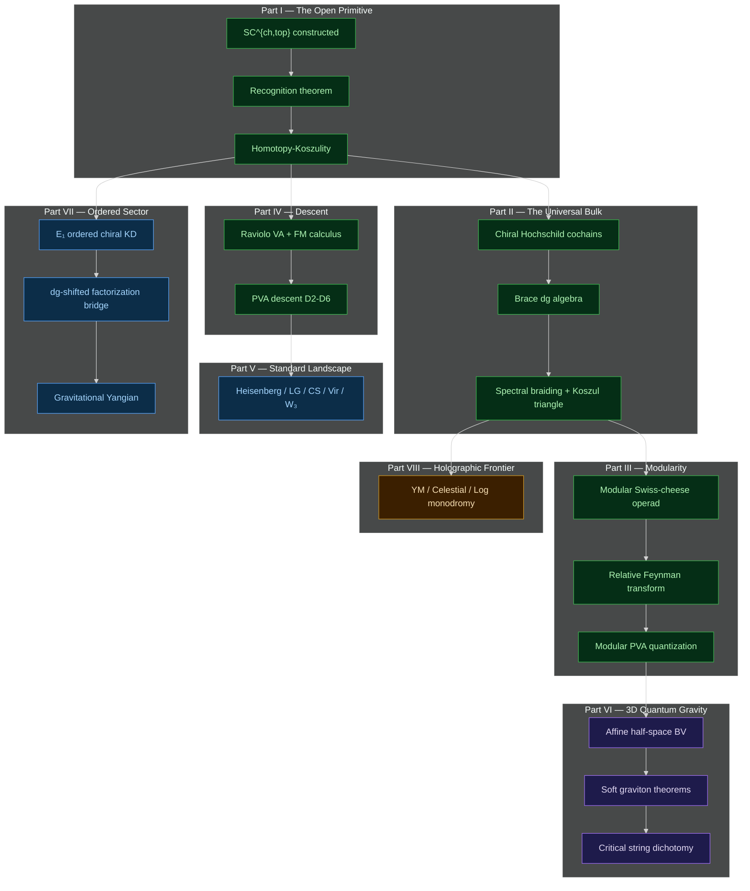

<div align="center">

<br>

# Modular Homotopy Theory for Algebraic Factorization Algebras on Algebraic Curves

### Volume 2: A&infin; Chiral Algebras and 3D Holomorphic&ndash;Topological QFT

<br>

*The bar differential is holomorphic factorization.*
*The coproduct is topological factorization.*
*Together they make a Swiss-cheese algebra on* FM<sub>k</sub>(&Copf;) &times; Conf<sub>k</sub>(&Ropf;).

<br>


<br>


<br>

</div>

---

<br>

## The Three-Volume Programme

This is the second volume of a three-volume programme on modular homotopy theory for chiral algebras.

| &ensp; | Volume | Subject | Role |
|:---:|--------|---------|------|
| **I** | [Modular Koszul Duality](https://github.com/raeez/chiral-bar-cobar) | Bar-cobar adjunction, Verdier intertwining, complementarity, modular characteristic, Hochschild duality | The algebraic engine |
| **II** | **A&infin; Chiral Algebras and 3D HT QFT** *(this volume)* | Swiss-cheese operads, PVA descent, bulk-boundary-line triangle, 3d quantum gravity, ordered sector | What the engine computes |
| **III** | [Calabi&ndash;Yau Quantum Groups](https://github.com/raeez/calabi-yau-quantum-groups) | Quantum vertex chiral groups, CoHA, Calabi&ndash;Yau categories, E<sub>2</sub> braiding | The categorical completion |

Volume I builds the categorical logarithm &mdash; the bar construction B(A) for chiral algebras on curves, with five theorems proving its existence, invertibility, branch structure, leading coefficient, and coefficient ring. Volume II reads the output in three dimensions: the bar complex carries a differential from &Copf;-direction factorization and a coproduct from &Ropf;-direction factorization, making it an algebra over the holomorphic&ndash;topological Swiss-cheese operad SC<sup>ch,top</sup> on &Copf; &times; &Ropf;. Volume III completes the picture categorically, with the E<sub>1</sub>-chiral theory from Part VII of this volume becoming the ordered/associative sector of the quantum vertex chiral group.

<br>

## Overview

The bar complex of a chiral algebra carries two structures: a **differential** d<sub>B</sub> from OPE residues on FM<sub>k</sub>(&Copf;), encoding the holomorphic chiral product, and a **coproduct** &Delta; from ordered deconcatenation on Conf<sub>k</sub>(&Ropf;), encoding the topological interval-cutting. Together, a bar element of degree k is parametrised by FM<sub>k</sub>(&Copf;) &times; Conf<sub>k</sub>(&Ropf;) &mdash; the product of holomorphic and topological configuration spaces. This product is the operadic fingerprint of a 3d holomorphic&ndash;topological QFT on &Copf;<sub>z</sub> &times; &Ropf;<sub>t</sub>, where observables factorize holomorphically in z and associatively in t.

The two-coloured Swiss-cheese operad SC<sup>ch,top</sup> has operation spaces FM<sub>k</sub>(&Copf;) &times; E<sub>1</sub>(m). The bar differential is the closed (holomorphic) colour. The bar coproduct is the open (topological) colour. The no-open-to-closed rule reflects that bulk interactions restrict to boundaries but not conversely. **The bar complex presents the Swiss-cheese algebra, as the Steinberg variety presents the Hecke algebra.**

At genus g &geq; 1: the curved bar complex with d<sub>fib</sub><sup>2</sup> = &kappa;(A) &middot; &omega;<sub>g</sub> is a curved SC<sup>ch,top</sup>-algebra. The non-vanishing of higher A<sub>&infin;</sub> operations IS the curved bar structure &mdash; formality fails precisely because the logarithm acquires monodromy.

The stable-graph modular bar coalgebra in log-FM coordinates carries the five-component differential D<sup>log</sup><sub>mod</sub> = d<sub>&#x010C;</sub> + d<sub>Ch<sub>&infin;</sub></sub> + d<sub>coll</sub> + d<sub>sew</sub> + d<sub>loop</sub>, with boundary operators as residue correspondences on log-FM strata. The one-edge principle governs the theory: **trees govern chirality; loops govern modularity**. A deformation theory that only remembers trees cannot see modular obstructions.

<br>

## Six Main Theorems

| &ensp; | Theorem | Statement | Consequence |
|:---:|---------|-----------|-------------|
| **F** | **Homotopy-Koszulity** | SC<sup>ch,top</sup> is homotopy-Koszul; bar-cobar on SC<sup>ch,top</sup>-algebras is a Quillen equivalence. | All formerly conditional results (filtered Koszul duality, C<sub>line</sub> &simeq; A<sup>!</sup>-mod, dg-shifted Yangian) become unconditional. |
| **G** | **PVA Descent** | On H<sup>&bullet;</sup>(A,Q): regular part of m<sub>2</sub> is commutative product, singular part is &lambda;-bracket; the pair is a (&minus;1)-shifted Poisson vertex algebra. | Extracts the entire classical shadow (Jacobi, Leibniz, skew-symmetry, sesquilinearity, Wick formula) from the quantum SC structure via five descent axioms D2&ndash;D6. |
| **J** | **Bulk-Boundary-Line** | A<sub>bulk</sub> &simeq; Z<sub>der</sub>(B<sub>&part;</sub>) &simeq; ChirHoch<sup>&bullet;</sup>(A<sup>!</sup>); line operators = A<sup>!</sup>-mod; spectral R-matrix satisfies YBE. | The bulk is the chiral derived center of the boundary, not the bar complex; line operators form the Koszul dual module category; the R-matrix governs braiding of line defects. |
| **K** | **Curved Swiss-Cheese** | At genus g &geq; 1: curved bar complex with d<sub>fib</sub><sup>2</sup> = &kappa;(A) &middot; &omega;<sub>g</sub> is a curved SC<sup>ch,top</sup>-algebra. | Formality failure IS the curved bar structure: the curvature &kappa;(A) from Vol I's Theorem D acquires its 3d physical meaning as Hodge deformation. |
| **L** | **Deformation Brace** | Chiral Hochschild cochains carry a brace algebra governing deformations of the SC<sup>ch,top</sup>-algebra. | Deformations of the 3d HT theory are controlled by a single dg algebraic structure, reducing the deformation problem to Maurer&ndash;Cartan theory. |
| **M** | **Modular PVA Quantization** | Stable-graph modular bar coalgebra + genus-raising operator = universal obstruction recursion for PVA-to-VA quantization. | Provides the systematic quantization machine: each genus level adds one handle, the obstruction at genus g is determined by all lower genera, and the recursion terminates iff &kappa;<sub>eff</sub> = 0. |

<br>

## Proof Status

The monograph has **zero conjectural algebraic inputs** beyond the standing physical axioms, which have themselves been made explicit as derived consequences.

> **Proved core.** &ensp; All six theorems F/G/J/K/L/M. Homotopy-Koszulity of SC<sup>ch,top</sup> (Kontsevich formality + transfer from classical Swiss-cheese). PVA descent D2&ndash;D6 (exchange cylinder + three-face Stokes on FM<sub>3</sub>(&Copf;)). Recognition theorem (Weiss cosheaf descent). Spectral Drinfeld strictification (root-space one-dimensionality + Jacobi collapse). Affine monodromy = quantum group R-matrix. W<sub>N</sub> Koszul duality for all N. Soft graviton theorems from shadow tower.
> &ensp; 1,887 claims proved here + 161 proved elsewhere. Every claim has a machine-readable status tag.

> **Frontier.** &ensp; Conditional and conjectural material is isolated in Part IX. No earlier part depends on Part IX. 178 precisely scoped conjectures remain, concentrated in the holographic and celestial sectors.
> &ensp; 34 heuristic claims, all explicitly flagged.

### Standing Hypotheses &mdash; Made Explicit

The former standing hypotheses (H1)&ndash;(H4) are no longer background axioms. They have been made into derived consequences:

| &ensp; | Content | Status |
|:---:|---------|--------|
| **(H1)** | BV data, one-loop finiteness | Condition of the physics bridge theorem &mdash; applies only to physical realisations |
| **(H2)** | Propagator: meromorphic in &Copf;, exponential decay in &Ropf; | Consequence of Q = &part;&#x0304; + d<sub>t</sub> splitting |
| **(H3)** | FM compactification, logarithmic forms, AOS relations | Theorem of configuration space geometry |
| **(H4)** | Factorization compatibility with C<sub>&ast;</sub>(W(SC<sup>ch,top</sup>)) | Recognition theorem &mdash; already proved |

All results in Parts I&ndash;VII hold unconditionally for any logarithmic SC<sup>ch,top</sup>-algebra. Physical theories provide the standard class of examples.

<br>

## Architecture

The monograph has ten parts. Parts I&ndash;VII are unconditional; Part VIII isolates the holographic/celestial frontier; Part IX collects all conditional and conjectural material; the Conclusion synthesises.



### Ten Parts in Detail

| Part | Title | Content |
|:----:|-------|---------|
| **I** | **The Open Primitive** | The primitive datum is a category, not an algebra: the open/closed factorization dg-category on a tangential log curve. SC<sup>ch,top</sup> constructed, recognition theorem proved (Weiss cosheaf descent), homotopy-Koszulity proved (Kontsevich formality + Livernet transfer). |
| **II** | **The Universal Bulk** | The bulk is the chiral derived center Z<sup>der</sup><sub>ch</sub>(A), not the bar complex. Chiral Hochschild cochains, brace dg algebra, bar-cobar review, line operators, spectral braiding (proved), Koszul triangle (proved), celestial boundary transfer (proved). |
| **III** | **Modularity as Trace and Clutching** | Modularity arises from trace and clutching on the open sector, not as an axiom on the closed algebra. Modular Swiss-cheese operad, relative Feynman transform, modular PVA quantization. |
| **IV** | **Descent and the Classical Shadow** | Extracts the classical PVA from the quantum SC structure. Raviolo VA, raviolo restriction, FM calculus, PVA descent D2&ndash;D6 all proved. |
| **V** | **The Standard HT Landscape** | Worked examples: Rosetta stone, free multiplet, Landau&ndash;Ginzburg, Chern&ndash;Simons (proved), Virasoro, W<sub>3</sub>. |
| **VI** | **Three-Dimensional Quantum Gravity** | Modular Koszul duality of Virasoro IS 3d quantum gravity. Affine half-space BV, planted-forest synthesis, gravitational complexity, soft graviton theorems, critical string dichotomy, symplectic polarisation. |
| **VII** | **The Ordered Sector** | The E<sub>1</sub> wing: ordered associative chiral Koszul duality (proved), dg-shifted factorization bridge (proved), gravitational Yangian. |
| **VIII** | **Holographic and Celestial Frontier** | Yang&ndash;Mills synthesis, celestial holography, logarithmic HT monodromy, anomaly-completed holography, modular bootstrap. |
| **IX** | **Extensions and Frontier** | All frontier/conjectural material from chapter splits. No earlier part depends on this part. |
| &ensp; | **Conclusion and Aftermatter** | Synthesis, appendices (brace signs, orientations, FM proofs, PVA expanded). |

<br>

## Connection to Volume I

Every chapter depends on Vol I's five theorems.

| Vol I Theorem | What it supplies to Vol II |
|:---:|---------------------------|
| **(A)** Bar-cobar adjunction | The bar complex exists as a factorization coalgebra; reinterpreted as SC<sup>ch,top</sup>-algebra structure &mdash; the bridge theorem |
| **(B)** Koszul inversion | Bar-cobar equivalence on the Koszul locus; lifted to raviolo VA setting and completed towers |
| **(C)** Complementarity | Genus-g obstructions decompose as complementary Lagrangians; the bulk-boundary-line triangle inherits this (&minus;1)-shifted symplectic structure |
| **(D)** Leading coefficient | Curvature &kappa;(A) &middot; &omega;<sub>g</sub> governs the genus tower; curved Swiss-cheese = Swiss-cheese + Hodge deformation |
| **(H)** Hochschild ring | BV-BRST origin of the deformation ring; bulk &simeq; chiral Hochschild (Theorem H gets its physical explanation) |

| Volume I concept | Volume II incarnation |
|-----------------|----------------------|
| Bar differential d<sub>B</sub> | &Copf;-direction factorization |
| Bar coproduct &Delta; | &Ropf;-direction factorization |
| Modular convolution L<sub>&infin;</sub> | Coloured modular deformation object (bulk + boundary + line) |
| &Theta;<sub>A</sub> graph-sum | Modular effective action S<sup>mod</sup><sub>HT</sub> |
| Shadow Postnikov tower | PVA coordinate spectral sequence |
| Koszul dual A<sup>!</sup> | dg-shifted Yangian (line operator category) |
| Complementarity | Bulk-boundary-line triangle |
| Genus-two shells | Loop&compfn;loop + sep&compfn;loop + planted-forest channels |

<br>

## What Volume III Reveals About Volume II

The E<sub>1</sub>/E<sub>&infin;</sub> hierarchy is the bridge between volumes.

Every Beilinson&ndash;Drinfeld chiral algebra (vertex algebra) is E<sub>&infin;</sub>-chiral &mdash; local, with &Sigma;<sub>n</sub>-equivariant factorization structure. The ordered bar complex B<sup>ord</sup>(A), constructed in Part VII of this volume, retains the linear ordering on configurations and carries an R-matrix as twisting datum. For E<sub>&infin;</sub>-chiral algebras with OPE poles, the R-matrix is derived from the local OPE; for genuinely E<sub>1</sub>-chiral algebras (quantum vertex algebras in the sense of Etingof&ndash;Kazhdan), the R-matrix is independent input.

This ordered/E<sub>1</sub> sector is exactly the input to Volume III:

- The **CoHA** (cohomological Hall algebra) is the E<sub>1</sub>-sector &mdash; the ordered associative chiral Koszul dual, computed via the ordered bar complex.
- The **full E<sub>2</sub> structure** adds the braiding &mdash; the quantum vertex chiral group of Volume III is the E<sub>2</sub>-algebra whose E<sub>1</sub>-skeleton is the ordered chiral Koszul dual of this volume.
- The **R-matrix descent** B<sup>ord</sup> &rarr; B<sup>&Sigma;</sup> (taking R-twisted &Sigma;<sub>n</sub>-coinvariants) is the passage from the ordered bar to the symmetric bar of Vol I &mdash; the E<sub>1</sub>&ndash;to&ndash;E<sub>&infin;</sub> descent. Volume III gives the E<sub>1</sub>&ndash;to&ndash;E<sub>2</sub> intermediate.

<br>

## Key Results

### Foundational

- **SC<sup>ch,top</sup> is homotopy-Koszul**: Kontsevich formality + transfer from classical Swiss-cheese (Livernet, Voronov, GK94). All formerly conditional results are now unconditional.
- **PVA descent D2&ndash;D6 all proved**: Exchange cylinder + three-face Stokes on FM<sub>3</sub>(&Copf;). Five axioms extract the full PVA structure from the quantum SC algebra.
- **Recognition theorem proved**: Weiss cosheaf descent (`lem:product-weiss-descent`). A factorization algebra satisfying the weight-form axiom IS an SC<sup>ch,top</sup>-algebra.
- **Zero conjectural algebraic inputs**: The former standing hypotheses (H1)&ndash;(H4) are either theorems or conditions of the physics bridge theorem. The pure-algebraic theory is self-contained.

### Dualities and Quantum Groups

- **Spectral Drinfeld strictification proved**: Root-space one-dimensionality forces the Drinfeld class to vanish at every filtration for all simple Lie algebras (`thm:complete-strictification`).
- **Affine monodromy = quantum group R-matrix**: Reduced HT monodromy recovers Rep<sub>q</sub>(&gfr;) on evaluation modules; Jones polynomial from bar complex. Proved for the affine lineage.
- **W<sub>N</sub> Koszul duality**: &alpha;<sub>N</sub> = 2(N&minus;1)(2N<sup>2</sup>+2N+1) generalises the Virasoro c &rarr; 26&minus;c duality to all W-algebras. The self-dual point c<sup>&ast;</sup> = &alpha;<sub>N</sub>/2 is distinct from the critical string point c<sub>crit</sub> = &alpha;<sub>N</sub>.

### Gravity and Soft Theorems

- **Soft graviton theorems from shadow tower**: Soft order p corresponds to arity r = p+2; the shadow Postnikov tower of Vol I directly controls the soft graviton hierarchy at genus 0.
- **Critical string dichotomy**: c &ne; 26 gives matrix-algebra factors (Clifford), perturbative gravity; c = 26 gives exterior-algebra factors, topological gravity. The dichotomy is whether &kappa;<sub>eff</sub> &middot; &omega;<sub>g</sub> vanishes.
- **W<sub>3</sub> quartic quasi-primary**: &Lambda; = :TT: &minus; (3/10)&part;<sup>2</sup>T with coefficient 16/(22+5c).

### Modular Structure

- **Modular PVA quantization**: The stable-graph modular bar coalgebra provides the universal obstruction recursion. Each genus level adds one handle; the obstruction at genus g is determined by all lower genera.
- **Genus-two shell decomposition**: First level where all three geometry types interact &mdash; loop&compfn;loop, sep&compfn;loop, and planted-forest channels.

<br>

## Cross-Volume Bridges

| Bridge | Status |
|--------|:------:|
| SC<sup>ch,top</sup> bar-cobar specialises Vol I Thm A when curve = &Copf;, topological = &Ropf; | **Proved** |
| Bar-cobar commutes with DS reduction | **Proved** |
| BV-BRST origin of Vol I Theorem H complex (all genera) | **Proved** |
| r(z) = &int;<sub>0</sub><sup>&infin;</sup> e<sup>&minus;&lambda;z</sup>{&middot;<sub>&lambda;</sub>&middot;}d&lambda; provides DK-0 shadow | **Proved** |
| PVA descent at X = pt recovers Coisson structure | **Proved** |
| Affine monodromy = quantum group R-matrix (affine lineage) | **Proved** |
| Shadow tower controls soft graviton hierarchy (genus 0) | **Proved** |
| &alpha;<sub>N</sub> generalises Virasoro c &rarr; 26&minus;c to all W<sub>N</sub> | **Proved** |
| Ordered bar &rarr; A<sup>!</sup><sub>line</sub>, symmetric bar &rarr; A<sup>!</sup><sub>ch</sub>; R-matrix descent | **Proved** |
| Annular bar B<sup>ann</sup>(A) computes HH<sup>ch</sup><sub>&bullet;</sub>(A) (genus-1 ordered sector) | **Proved** |
| Commutator filtration spectral sequence; E<sub>1</sub>-page = FG bar | **Proved** |
| Gauge-gravity dichotomy: m<sub>k</sub> = 0 (gauge) vs m<sub>k</sub> &ne; 0 (gravity); DS transports L &rarr; M | **Proved** |
| Feynman-diagrammatic m<sub>k</sub> matches bar differential (genus 0) | **Proved** |
| Genus tower: F<sub>g</sub> &ne; 0 iff &kappa;<sub>eff</sub> &ne; 0 iff S-transform anomalous | **Proved** |

<br>

## Repository Layout

```
chiral-bar-cobar-vol2/
├── main.tex                            entry point (preamble + \input's)
├── Makefile                            build system
├── chapters/
│   ├── frame/                          preface (1 file)
│   ├── theory/                         Parts I + IV (~16 files)
│   ├── examples/                       Part V (~13 files)
│   └── connections/                    Parts II + III + VI + VII + VIII + IX (~65 files)
├── appendices/                         brace signs, orientations, FM proofs, PVA expanded
├── bibliography/                       references
└── notes/                              session prompts, programmes, research notes
```

<details>
<summary><b>Theory</b> &ensp; <code>chapters/theory/</code> &ensp; Parts I + IV</summary>

&nbsp;

| File | Part | Subject |
|------|:----:|---------|
| `foundations.tex` | I | SC<sup>ch,top</sup> foundations, open/closed factorization |
| `locality.tex` | I | Locality axioms, Weiss descent |
| `axioms.tex` | I | Factorization axiomatics |
| `equivalence.tex` | I | Recognition theorem, homotopy-Koszulity |
| `bv-construction.tex` | I | BV construction for SC<sup>ch,top</sup> |
| `factorization_swiss_cheese.tex` | I | Factorization Swiss-cheese structure |
| `raviolo.tex` | I | Raviolo vertex algebras |
| `raviolo-restriction.tex` | I | Raviolo restriction functor |
| `fm-calculus.tex` | IV | FM calculus on configuration spaces |
| `pva-descent-repaired.tex` | IV | PVA descent D2&ndash;D6 (proved) |
| `introduction.tex` | &mdash; | Global introduction |

</details>

<details>
<summary><b>Examples</b> &ensp; <code>chapters/examples/</code> &ensp; Part V</summary>

&nbsp;

| File | Subject |
|------|---------|
| `rosetta_stone.tex` | Rosetta stone: dictionary between Vol I and Vol II structures |
| `examples-computing.tex` | Core computations |
| `examples-worked.tex` | Worked examples (Heisenberg, free multiplet, LG) |
| `examples-complete-proved.tex` | Proved computations (CS, standard families) |
| `examples-complete-conditional.tex` | Conditional computations (Part IX) |
| `w-algebras-stable.tex` | W-algebra general framework |
| `w-algebras-virasoro.tex` | Virasoro: quartic poles, infinite shadow depth, c &rarr; 26&minus;c duality |
| `w-algebras-w3.tex` | W<sub>3</sub>: quartic quasi-primary, &alpha;<sub>3</sub> = 100 |
| `w-algebras-conditional.tex` | W-algebra conditional/frontier material |

</details>

<details>
<summary><b>Connections</b> &ensp; <code>chapters/connections/</code> &ensp; Parts II + III + VI + VII + VIII + IX</summary>

&nbsp;

| File | Part | Subject |
|------|:----:|---------|
| `hochschild.tex` | II | Chiral Hochschild cochains |
| `brace.tex` | II | Brace dg algebra |
| `bar-cobar-review.tex` | II | Bar-cobar review (bridge from Vol I) |
| `line-operators.tex` | II | Line operators = A<sup>!</sup>-mod |
| `spectral-braiding-core.tex` | II | Spectral braiding (proved core) |
| `ht_bulk_boundary_line_core.tex` | II | Bulk-boundary-line triangle (proved core) |
| `celestial_boundary_transfer_core.tex` | II | Celestial boundary transfer (proved core) |
| `ht_physical_origins.tex` | II | Physical origins of HT structure |
| `modular_swiss_cheese_operad.tex` | III | Modular Swiss-cheese operad |
| `relative_feynman_transform.tex` | III | Relative Feynman transform |
| `modular_pva_quantization_core.tex` | III | Modular PVA quantization (proved core) |
| `affine_half_space_bv.tex` | VI | Affine half-space BV formalism |
| `fm3_planted_forest_synthesis.tex` | VI | FM<sub>3</sub> planted-forest synthesis |
| `3d_gravity.tex` | VI | 3d gravity movements |
| `thqg_soft_graviton_theorems.tex` | VI | Soft graviton theorems |
| `thqg_critical_string_dichotomy.tex` | VI | Critical string dichotomy (c = 26 vs c &ne; 26) |
| `thqg_perturbative_finiteness.tex` | VI | Perturbative finiteness |
| `ordered_associative_chiral_kd_core.tex` | VII | Ordered associative chiral KD (proved) |
| `dg_shifted_factorization_bridge.tex` | VII | dg-shifted factorization bridge (proved) |
| `thqg_gravitational_yangian.tex` | VII | Gravitational Yangian |
| `ym_synthesis_core.tex` | VIII | Yang&ndash;Mills synthesis |
| `celestial_holography_core.tex` | VIII | Celestial holography |
| `log_ht_monodromy_core.tex` | VIII | Logarithmic HT monodromy |
| `anomaly_completed_core.tex` | VIII | Anomaly-completed holography |
| `conclusion.tex` | &mdash; | Conclusion and synthesis |

*Frontier files (Part IX):* `spectral-braiding-frontier.tex`, `ht_bulk_boundary_line_frontier.tex`, `celestial_boundary_transfer_frontier.tex`, `modular_pva_quantization_frontier.tex`, `ordered_associative_chiral_kd_frontier.tex`, `ym_synthesis_frontier.tex`, `celestial_holography_frontier.tex`, `log_ht_monodromy_frontier.tex`, `anomaly_completed_frontier.tex`.

</details>

<details>
<summary><b>Appendices</b> &ensp; <code>appendices/</code></summary>

&nbsp;

| File | Subject |
|------|---------|
| `brace-signs.tex` | Brace algebra sign conventions |
| `orientations.tex` | Orientation conventions for configuration spaces |
| `fm-proofs.tex` | FM compactification proofs |
| `pva-expanded-repaired.tex` | Expanded PVA axiom verification |

</details>

<br>

## Building

```bash
make                 # Full build (5-pass pdflatex for convergence)
make fast            # Single-pass pdflatex (quick check)
```

> **Requirements**: TeX Live 2024+ with `pdflatex`. Same package requirements as Volume I (memoir, EB Garamond, newtxmath, thmtools, microtype).

<br>

---

<div align="center">

<sub>1,344 pages &ensp;&middot;&ensp; 99 active .tex files &ensp;&middot;&ensp; 2,260 tagged claims &ensp;&middot;&ensp; 100% claim-tag coverage</sub>

</div>
